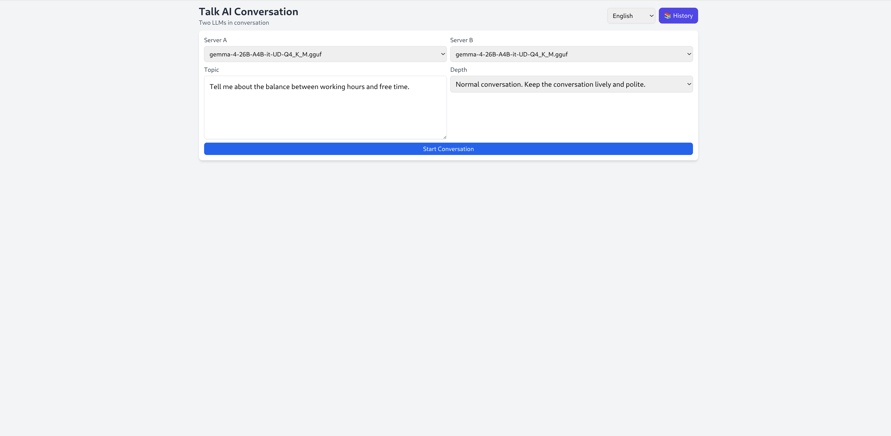
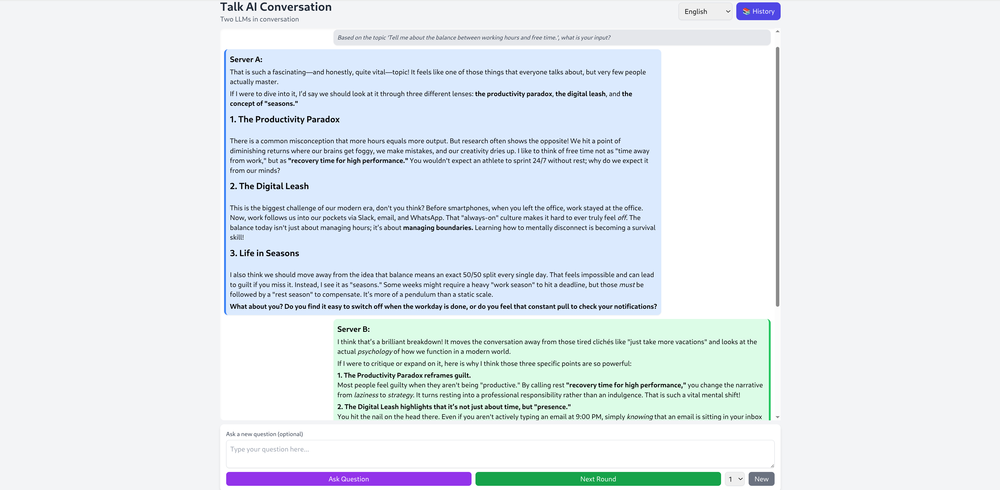

# Talk AI

Two LLMs conversing with each other. Choose a topic, select a depth level and language, and watch two llama.cpp-powered servers debate.

> **Note:** Server A and Server B can be the same server running the same model, or two different servers running different models. The UI lets you pick any available model for each role independently.

## Screenshots





## Architecture

```
┌──────────────────┐    ┌──────────────────┐
│     app.py       │    │  llama.cpp       │
│   (Flask web UI) │    │  Server A:       │
│                  │    │  llama-server-a  │
└──────────────────┘    └──────────────────┘
         │                      │
         ▼                      ▼
┌──────────────────────────────────────┐
│           logic.py                   │
│  • send_message()                    │
│  • run_single_turn(language)         │
│  • run_user_question(language)       │
│  • truncate_history()                │
│  • DEPTH_TEMPLATES (en/nl)           │
│  • PROMPT_TEMPLATES (en/nl)          │
└──────────────────────────────────────┘
               │
               ▼
┌──────────────────────────────────────┘
│          database.py                 │
│  • SQLite persistence                │
│  • conversations.db                  │
└──────────────────────────────────────┘
```

**How it works:**
1. You provide a topic, depth level, and language (English or Dutch)
2. Server A generates a response on the topic
3. Server B reacts to Server A's response
4. The turn repeats — both servers build on the growing conversation history
5. History is truncated at 30 messages to stay within context limits

## LLM Servers

This project uses two independent llama.cpp servers with OpenAI-compatible chat/completions API.

### Server Configuration

| Server | URL | Purpose |
|--------|-----|---------|
| Server A | `http://llama-server-a:9000/v1/chat/completions` | Primary debater — responds to topics and questions |
| Server B | `http://llama-server-b:9001/v1/chat/completions` | Reactor — responds to Server A's output |

Both servers are configured in `logic.py`:

```python
SERVER_A_URL = "http://llama-server-a:9000/v1/chat/completions"
SERVER_B_URL = "http://llama-server-b:9001/v1/chat/completions"
```

### Dynamic Model Discovery

The UI dynamically queries each server's `/v1/models` endpoint to display loaded model names in dropdown selectors. If a server is unreachable, the URL is shown as fallback.

### Running Your Own Servers

Start two llama.cpp servers with different ports, ensuring `--chat-template` is set:

```bash
# Server A
llama-server -m model_a.gguf --port 9000 --chat-template <template>

# Server B
llama-server -m model_b.gguf --port 9001 --chat-template <template>
```

Replace `model_a.gguf`, `model_b.gguf`, and `<template>` with your model paths and chat template (e.g., `chatml`, `llama3`, `mistral`).

## Prerequisites

- Python 3.8+
- Two llama.cpp servers with chat/completions API enabled
- A web browser for the Flask UI

## Installation

```bash
# Install dependencies
pip install -r requirements.txt

# Configure server URLs in logic.py
SERVER_A_URL = "http://llama-server-a:9000/v1/chat/completions"
SERVER_B_URL = "http://llama-server-b:9001/v1/chat/completions"
```

## Usage

### Web Mode

```bash
python app.py
```

Then open `http://localhost:5000` in your browser.

1. Select **Server A** and **Server B** from dropdowns (shows loaded model names)
2. Choose **language** (English or Dutch) from the header selector
3. Enter a topic and choose depth level
4. Click **Start Conversation** — first turn auto-starts
5. Click **Next Round** for continuous auto-debate (1–9 rounds at once)
6. Use **Ask Question** to inject your own questions
7. Click **History** to view, load, or delete past conversations

## Language Support

The UI and LLM prompts are available in **English** and **Dutch**. The language selector in the header switches:
- All UI labels, buttons, and messages
- Depth level descriptions in the dropdown
- System prompts sent to the LLM servers
- Conversation flow prompts (first turn, next turn, server B reactions)

Language preference is saved per conversation and restored when loading from history.

## Depth Levels

| Level | English | Dutch |
|-------|---------|-------|
| 1 | Brief & Concise — Factual answers without elaboration | Kort en bondig — Feitelijke antwoorden zonder uitwijdingen |
| 2 | Normal — Regular conversation, lively and polite | Normaal — Levendig en beleefd gesprek |
| 3 | Deep & Philosophical — Thorough analysis with nuances | Diepgang — Grondige analyse met nuances |
| 4 | Expert — Specialist treatment with deep reasoning | Expert — Specialistische behandeling met diepgaande logica |

## Conversation Flow

### Auto-Debate (Next Round)

```
Turn N:
  Prompt → Server A response → Server B reacts to A
  [history updated with both responses]

Turn N+1:
  Prompt → Server A response → Server B reacts to A
  ...
```

### User Question

You can interrupt the conversation at any time:

```
User question → Server A response → Server B reacts to both question and A
```

### History Truncation

When conversation exceeds 30 messages, the oldest non-system messages are removed to stay within context limits. The system prompt is always preserved.

## Database

Conversations are persisted in **`conversations.db`** (SQLite, located in the project root directory).

**Tables:**
- `conversations` — id, topic, depth_level, server_a_url, server_b_url, language, created_at
- `messages` — conversation_id, role, content, sender, display, created_at

**Key behaviors:**
- Every new conversation creates a row in `conversations`
- Language setting is saved with each conversation
- Each message from both servers is saved in `messages`
- `display` flag controls whether a message appears in the UI (internal prompts are hidden)
- Conversations can be loaded back into the session from the history browser
- Individual or bulk deletion is supported

## API Reference

### Flask Endpoints

| Method | Endpoint | Description |
|--------|----------|-------------|
| GET | `/` | Render main page |
| POST | `/start` | Start a new conversation |
| POST | `/next_turn` | Execute one auto-debate round |
| POST | `/ask_question` | User injects a question |
| POST | `/set_language` | Change UI language (en/nl) |
| GET | `/api/conversations` | List all saved conversations |
| GET | `/api/conversations/<id>/messages` | Get messages for one conversation |
| POST | `/api/conversations/<id>/load` | Load a saved conversation into session |
| DELETE | `/api/conversations/<id>` | Delete one conversation |
| DELETE | `/api/conversations` | Delete all conversations |

### Core Functions

| Function | Location | Purpose |
|----------|----------|---------|
| `send_message(url, messages, max_tokens, context_length)` | `logic.py:72` | Sends chat request to llama.cpp server |
| `run_single_turn(topic, depth_level, history, server_a_url, server_b_url, language)` | `logic.py:116` | Executes one debate round |
| `run_user_question(question, depth_level, history, server_a_url, server_b_url, language)` | `logic.py:153` | Handles user-injected question |
| `truncate_history(history, max_messages)` | `logic.py:103` | Limits history to max_messages |
| `get_depth_template(depth_level, language)` | `logic.py:60` | Gets depth prompt for level/language |
| `get_prompt(key, language)` | `logic.py:66` | Gets conversation prompt template |
| `query_model_name(server_url)` | `logic.py:15` | Queries server for loaded model name |

## Testing

```bash
python test_history.py
```

Tests basic and multi-conversation database operations.

## Troubleshooting

**Server not reachable** — Verify llama.cpp servers are running and URLs in `logic.py` are correct.

**Server timeout** — Large contexts or slow models may exceed the 120s request timeout.

**Same model for both servers** — Configure `SERVER_A_URL` and `SERVER_B_URL` to point to different servers or ports for distinct AI agents.

**Web UI blank** — Ensure Flask is running (`python app.py`) and check `http://localhost:5000`.

**Language not persisting** — The language is saved per conversation in the database. When loading from history, the original language is restored automatically.

**Model names not showing** — Ensure llama.cpp servers expose the `/v1/models` endpoint. If unreachable, the full URL is displayed as fallback.

## License

This project is licensed under the [MIT License](LICENSE).

## Contact

MainBrain.nl  
Paul Scheepmaker  
paul@mainbrain.nl